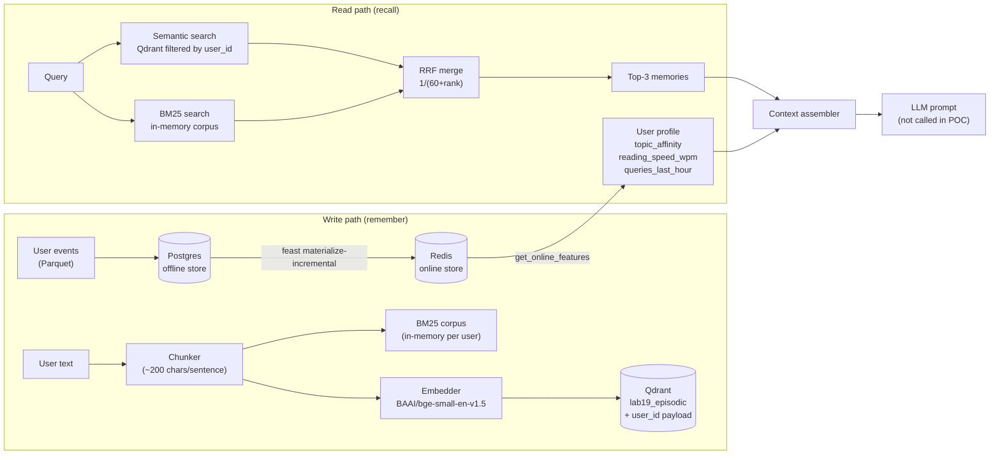

# Architecture: HybridMemoryAgent — AI Memory System for Vietnamese Users

**Contributors:** TruongSon412

---

## Tổng quan

Hệ thống gồm 2 memory planes kết hợp:

- **Episodic memory** (vector store) — lưu những gì user đã đọc/nói, dùng hybrid search để recall.
- **Stable + recent profile** (feature store) — lưu hành vi dài hạn (topic affinity, reading speed) và hoạt động ngắn hạn (queries_last_hour).

Khi user hỏi, hệ thống kết hợp cả hai nguồn để build context trước khi gọi LLM.

---

## Sơ đồ kiến trúc

---

## Quyết định kiến trúc 1: Chunking strategy

**Lựa chọn:** Chia text theo sentence boundary (~200 ký tự mỗi chunk), split trên `". "`.

**Tradeoff:**

| Strategy | Retrieval quality | Storage cost | Context window |
|---|---|---|---|
| Per-sentence (~200 chars) | Cao — mỗi chunk là 1 ý, query cụ thể sẽ match đúng chunk | Nhiều points hơn trong Qdrant | Mỗi memory ngắn, dễ fit nhiều vào context |
| Per-conversation (toàn bộ) | Thấp — 1 vector đại diện nhiều ý, query cụ thể bị "diluted" | Ít points | 1 memory có thể chiếm toàn bộ context window |
| Semantic break (NLP-based) | Tốt nhất | Trung bình | Tốt | Cần dependency (e.g. spaCy, underthesea) |

**Chọn per-sentence vì:** trong episodic memory của trợ lý cá nhân, user thường hỏi về 1 khái niệm cụ thể ("Kubernetes scale như thế nào?"), không phải toàn bộ session. Per-sentence cho recall granular hơn. Nhược điểm: cùng 1 document bị split ra nhiều points, Qdrant phải filter nhiều hơn.

**Liên hệ lab:** Pattern này giống NB2 — mỗi doc trong corpus cũng được index độc lập; RRF merge nhiều kết quả rời rạc về 1 ranked list.

---

## Quyết định kiến trúc 2: Feature schema — tabular vs embedding features

**Lựa chọn:** Tabular features đơn giản: `reading_speed_wpm` (Int64), `topic_affinity` (String), `queries_last_hour` (Int64).

**Tradeoff:**

| Pattern | Ưu điểm | Nhược điểm |
|---|---|---|
| Tabular features (chọn) | Interpretable, fast lookup <5ms, dễ debug, Feast hỗ trợ tốt | Không capture latent preference — user thích "cloud security" nhưng `topic_affinity` chỉ lưu "cloud" |
| Embedding features (latent prefs) | Capture nuance hơn, có thể re-rank dựa trên cosine sim với query | Cần training pipeline riêng (matrix factorization / two-tower), re-index phức tạp, không trivial với Feast |

**Chọn tabular vì:** POC cần chạy được và demonstrable trong vài giờ. Embedding features là bước tiếp theo hợp lý khi có đủ interaction data.

**TTL được chọn dựa trên business semantics (không để AI tự chọn):**
- `user_profile_features`: TTL=30 ngày — reading speed và topic affinity thay đổi theo tháng.
- `query_velocity_features`: TTL=1 giờ — queries_last_hour là real-time signal, data cũ hơn 1h là stale (fraud-detection pattern từ slide §6).

**Liên hệ lab:** TTL decision là *think-hard* theo BONUS-CHALLENGE.md — sai TTL dẫn đến training-serving skew như PIT join khi dùng historical features sai timestamp.

---

## Quyết định kiến trúc 3: Freshness strategy

**3 use cases với freshness khác nhau:**

| Use case | Freshness cần | Mechanism |
|---|---|---|
| User vừa đọc doc mới | Sub-second (real-time) | `remember()` upsert thẳng vào Qdrant ngay khi user đọc xong — không cần batch |
| Topic affinity thay đổi | Daily | `feast materialize-incremental` chạy hàng ngày; `user_profile_features` TTL=30d chịu được lag 24h |
| Fraud-style activity burst (queries_last_hour) | <1 giờ | `query_velocity_features` TTL=1h; pipeline push event mới → materialize mỗi 15 phút |

**Lý do không dùng streaming Push API cho tất cả:** Chi phí infra tăng đáng kể (cần Kafka/Flink), trong khi stable profile không cần freshness dưới 1 ngày. Chỉ velocity features cần near-realtime; episodic memory dùng direct upsert (không qua batch pipeline) vì Qdrant cho phép write trực tiếp.

---

## Lựa chọn bị loại bỏ (rejected alternative)

**Tôi xem xét lưu episodic memory như một Feast embedding feature view** — tức là mỗi memory chunk được lưu thành 1 row trong offline store với cột embedding (Float array), dùng Feast `get_online_features` để fetch và tự implement ANN search.

**Lý do loại bỏ:** Feast không có native ANN search — phải implement cosine similarity bằng tay trên Python sau khi fetch tất cả vectors. Với 10,000 memories, đây là O(N) scan, không scalable. Hơn nữa, re-index cycle khác nhau hoàn toàn: episodic memory cập nhật mỗi session (sub-hour), trong khi user profile cập nhật hàng ngày/tuần. Trộn 2 chu kỳ này vào cùng 1 Feast store làm TTL management phức tạp không cần thiết.

**Chọn Qdrant riêng vì:** Qdrant được thiết kế cho ANN search, hỗ trợ payload filter (`user_id`), và tách biệt hoàn toàn read/write cycle với Feast.

---

## Vietnamese-context considerations

**1. Tokenizer cho BM25:**
BM25 trong POC này dùng `text.lower().split()` — whitespace tokenizer. Điều này hoạt động tốt với tiếng Anh và mixed text như "Kubernetes cluster scaling". Tuy nhiên, tiếng Việt **không dùng space để phân tách từ** trong nhiều trường hợp compound words: "học máy" (2 từ) vs "họcmáy" (typo). `underthesea.word_tokenize()` hoặc `pyvi` sẽ cải thiện BM25 recall cho queries thuần Việt, nhưng thêm 1 dependency nặng. **Quyết định:** dùng whitespace cho POC, production → underthesea.

**2. Code-switching (vi/en mix):**
User Việt Nam thường mix: "Kubernetes cluster của tôi bị crash khi scale". BM25 match tốt cho "Kubernetes" (exact), semantic search catch "scale" → "auto-scaling" (paraphrase). RRF merge giải quyết tự nhiên: 2 retriever bổ sung nhau cho mixed-language query.

**3. Privacy — Nghị định 13/2023:**
Filter `user_id` trong Qdrant payload là **isolation về logic, không phải cryptographic isolation**. User A có thể truy cập memory của user B nếu biết user_id. Production cần: per-user Qdrant collection (hard isolation) hoặc field-level encryption (AES per user key). Đây là limitation rõ ràng của POC này.

---

## Limitations (What this POC doesn't handle yet)

- **Memory decay:** Không có TTL cho episodic memory trong Qdrant. Memories tích lũy vô hạn. Production cần pruning policy (e.g., không truy cập >30 ngày → archive sang cold storage).
- **Privacy isolation:** `user_id` payload filter không phải cryptographic isolation. Không đáp ứng Nghị định 13/2023 cho dữ liệu cá nhân nhạy cảm.
- **Memory CRUD:** Không có `forget()` method — user không thể xóa memory cụ thể.
- **Multi-device sync:** BM25 corpus lưu in-memory, không persist giữa các session. Restart agent → BM25 mất; Qdrant vẫn còn nhưng cần reload corpus.
- **LLM integration:** `recall()` chỉ return context string, không gọi LLM thật. Production cần prompt template và LLM API call.
- **Feast streaming pipeline:** `query_velocity_features` trong POC vẫn dùng batch materialize, không phải streaming push. Real-time velocity cần Kafka + Feast push API.

---

## Vibe coding workflow log

**Prompt hiệu quả nhất:** "Reuse NB2 RRF pattern for hybrid search in agent.py — same `1/(60+rank)` formula, same BM25Okapi, same fastembed model. Just add Qdrant payload filter for user_id isolation."

**Prompt fail:** "Design the best memory architecture." → Quá broad, AI trả về generic architecture không liên kết với lab concepts (PIT join, TTL, RRF). Phải narrow lại thành "3 decisions each with explicit X vs Y tradeoff tied to lab §6 concepts."
